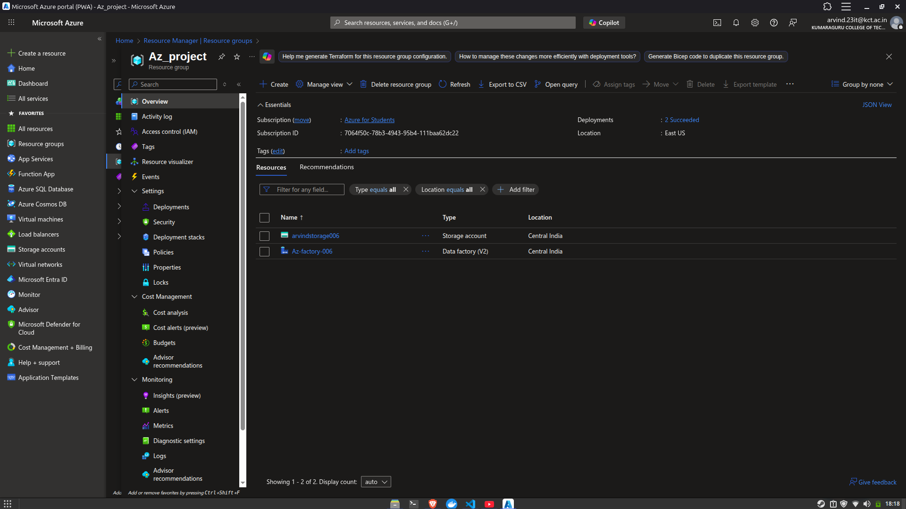
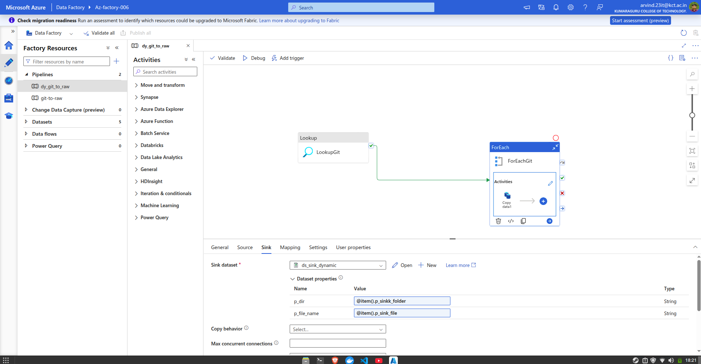
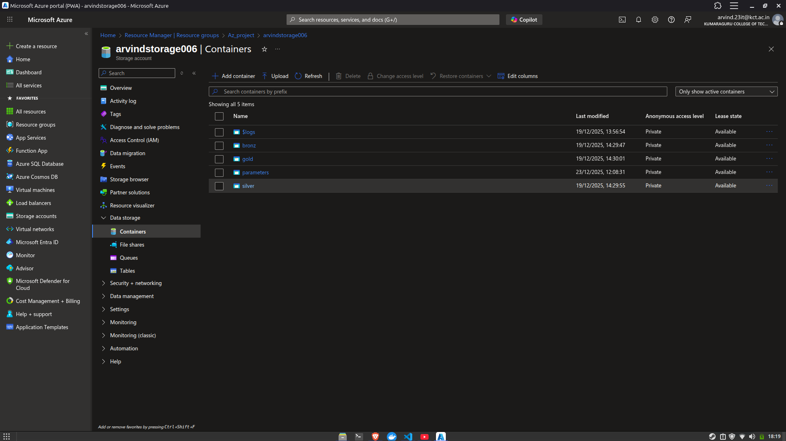

# Adventure Works Data Pipeline

Azure-based data engineering pipeline implementing Bronze and Silver layers for AdventureWorks dataset ingestion and transformation.

## Architecture



**Infrastructure:**
- Azure Data Factory - Pipeline orchestration
- Azure Data Lake Storage Gen2 - Multi-layer storage (bronz/silver/gold)
- Azure SQL Database - Data warehouse

## Bronze Layer - Data Ingestion



Configuration-driven ADF pipeline with three activities:
1. **Lookup** - Reads `git.json` config from blob storage
2. **ForEach** - Iterates through dataset array with parallel execution
3. **Copy Activity** - Dynamic HTTP → ADLS data movement

**Dynamic Expression Pattern:**
```javascript
@concat('https://raw.githubusercontent.com/', item().p_rel_url)
@concat('/data/raw/', item().p_sinkk_folder, '/', item().p_sink_file)
```



### Pipeline Configuration

The `git.json` file drives the entire ingestion process:

```json
[
    {
        "p_rel_url": "ARVIND-36/DE-AZURE-pipeline/main/Data/AdventureWorks_Calendar.csv",
        "p_sinkk_folder": "calendar",
        "p_sink_file": "calendar.csv"
    }
]
```

**Datasets:** 10 AdventureWorks tables (~200K total records)
- Calendar, Customers, Products, Product Categories/Subcategories
- Sales (2015-2017), Returns, Territories

**Key Design:**
- Parameterized linked services and datasets for reusability
- Single pipeline handles all sources via config iteration
- Parallel ForEach execution for performance
- Scalable to 100+ datasets without pipeline changes

## Silver Layer - PySpark Transformation

Data cleaning and standardization using PySpark. Implementation details in `silver-pyspark-transformation/`

## Project Structure

```
├── bronze-adf-ingestion/
│   ├── azure-templates/       # ARM templates & architecture screenshots
│   ├── Data/                  # Sample CSV files
│   ├── git.json              # Pipeline configuration
│   └── README.md
│
├── silver-pyspark-transformation/
│   └── README.md
│
├── .env.example              # Azure credentials template
└── .gitignore
```

---

**Stack:** Azure Data Factory · ADLS Gen2 · PySpark · Azure SQL Database
