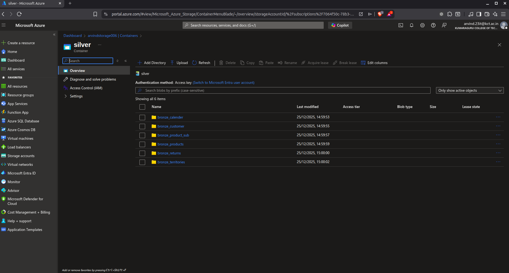

# Silver Layer - PySpark Transformation

PySpark notebook for data cleaning and transformation: Bronze → Silver layer.

## Transformations Applied

**Calendar Table:**
- Extracted `Month` and `Year` from Date column
- Added temporal dimensions for time-series analysis

**Customers Table:**
- Created `FullName` column concatenating Prefix, FirstName, LastName
- Consolidated customer identification

**Products Table:**
- Split `ProductSKU` to extract base identifier
- Parsed `ProductName` to first word for standardization

**Sales Table:**
- Converted `StockDate` to proper timestamp format
- Replaced order number prefix: 'S' → 'T' using regex
- Added calculated column: `multiply` (OrderLineItem × OrderQuantity)
- Aggregated daily order counts by OrderDate

**Other Tables:**
- Product Subcategories, Returns, Territories - No transformation (direct load)

## Output

All transformed data written to `silver/` container in Parquet format with append mode.

**Format:** CSV (Bronze) → Parquet (Silver) for better compression and query performance.

## Notebook

[notebook_1.ipynb](./notebook_1.ipynb) - Full implementation with outputs